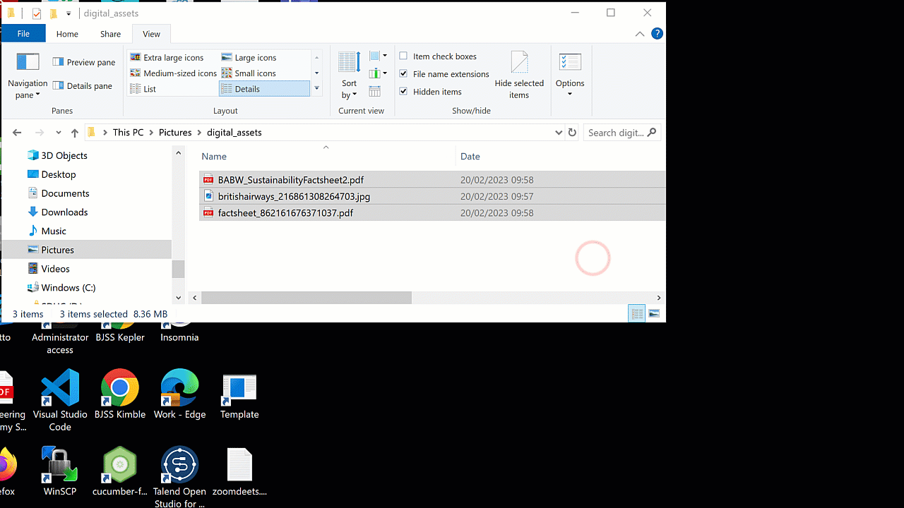

# Zip files

## What's a zip file?

Zip files are a way of compressing one or more files or folders into a single file. This makes them easier to store, transfer, and share. 

Imagine this. You're sitting in a bustling café with your friend Sarah, sipping on your favorite brew:

**Sarah:** "Hey, do you know how I can send all these photos from our trip to Hawaii to my family without clogging up their inbox?"

**You:** "Oh, easy! Just zip 'em up into a Zip file. It's like squishing all those photos into a single package."

**Sarah: **"Oh, cool! But why would I do that instead of just sending the photos as they are?"

**You:** "Well, think about it this way. When you zip them up, it's like squeezing out all the air from a bag of crisps to make it more compact. So, your photos take up less space, making them quicker to send and easier for your family to download."

**Sarah:** "Ah, got it! So, it's like giving them a neatly wrapped gift instead of a big messy pile."

**You:** "Exactly! Plus, if you've got a bunch of documents or files scattered all over your computer, you can zip them into one tidy folder. It's like decluttering your digital space."

**Sarah:** "Nice! And I guess it's handy for storing files long-term too, right?"

**You:** "Yep, Zip files are like little time capsules for your digital stuff. You can pack 'em away for safekeeping and unpack them whenever you need."

**Sarah:** "That sounds really useful. Thanks for the tip!"

Zip files are essentially *archives* that contain one or more files or folders. They use a compression algorithm to reduce the size of the files, making them more manageable. When you "zip" files together, you're essentially bundling them up into a single file, which you can then unzip to access the original files.

## History

The Zip file format was invented by Phil Katz in 1989. It was originally implemented in a software program called PKZIP for MS-DOS. The name "Zip" comes from the idea of compressing files into a "zipper" or a single container. Since then, the Zip format has become one of the most widely used methods for compressing files on various operating systems, including Windows.

## Using Zip Files in Windows

### Creating a Zip file:

1. Select the files or folders you want to compress.
2. Right-click on the selected items.
3. Choose "Send to" from the context menu.
4. Select "Compressed (zipped) folder." This will create a new Zip file containing the selected items.

### Extracting files from a Zip file:

1. Locate the Zip file on your computer.
2. Double-click on the Zip file to open it.
3. You can then either drag the files out of the Zip folder into a desired location or select "Extract all" from the toolbar at the top and choose a destination folder for the extracted files.

### Viewing the contents of a Zip file:

If you want to see what's inside a Zip file without extracting it, you can simply double-click on the Zip file. This will open it in File Explorer, allowing you to view its contents like you would with any other folder.

### Adding files to an existing Zip file:

If you want to add more files to an existing Zip file, simply drag and drop the files you want to add onto the Zip file. Alternatively, you can open the Zip file, then copy and paste the files you want to add into the Zip folder.

## Additional Tips
- You can encrypt Zip files with a password for added security.
- There are many third-party compression tools available for Windows, but the built-in support for Zip files in Windows Explorer is usually sufficient for most users.
- Zip files are commonly used for packaging files for distribution over the internet or for archiving files for storage.